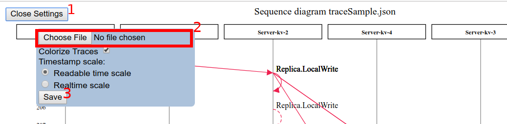

## Message sequence visualizer for whirl network traces

### How to use
In order to generate traces run your simulation with `--trace <path>`. This makes sense to do only when `--seed <number>` flag is set.
```bash
clippy test --seed 1234512345 --trace /tmp/trace.json
```

After a trace is recorded you can open it with the visualizer. Just select the trace file in `Onen Settings -> Choose File`.



Arrows and message labels are clickable!
